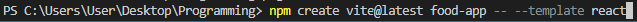
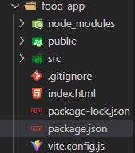
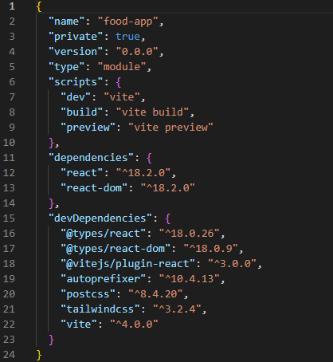
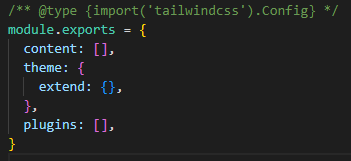
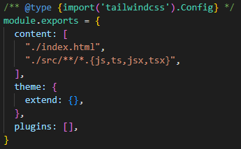
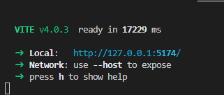

# Setting Up React and Tailwind CSS Project with Vite
Make Sure nodejs is install and npm is working
## Step 1 – Create Your Project Folder

Open your terminal, and navigate to the folder where you want to build your project – for example Desktop. Input the command below in the terminal and click enter:‌

`
  npm create vite@latest your-project-name -- --template react
`

"your-project-name" shoud be replaced with your project name. food-app for example

The command above will create your project folder.‌

My project name is "food-app", the food-app folder will be created in the Programming folder on my Desktop

  **PS C:\Users\User\Desktop\Programming> `npm create vite@latest food-app -- --template react`**

**‌Note:** that we have used `-- --template react` to specify that we are building a React app with Vite.

## Step 2 – Navigate to Your Project Folder

Input the command below in your terminal and click enter:
`
  cd food-app
`

‌This command will navigate to your project folder. You should have this:

**PS C:\Users\User\Desktop\Programming> `cd food-app`**
**PS C:\Users\User\Desktop\Programming\food-app**

Inputing `cd food-app` in terminal to navigate to the "food-app" folder

## Step 3 – Install Tailwind CSS and Other Dependencies
Input the command below in your terminal and click enter:

`
  npm install -D tailwindcss postcss autoprefixer
`

Input this command to install the tailwindcss, postcss and autoprefixer dependencies

This command will install the following:

* The Tailwind CSS framework
* Post CSS, which provides plugins to perform different functionalities like prefixes in Vanilla CSS
* Autoprefixer, which is a PostCSS plugin to parse CSS and add vendor prefixes to CSS rules.

Your folder should look like this in your VSCode:‌

Confirm that you have the below text in your `package.json‌:`

Notice the autoprefixer, postcss and tailwindcss dependencies from line 19 - 21. The version number might have changed when you read this.

## Step 4 – Generate the Configuration Files
Input the command below in your terminal and click enter:
`
  npx tailwindcss init -p
`

This command will generate tailwindcss config file

This command generates `tailwind.config.cjs` and `postcss.config.cjs` configuration files, also known as config files. They help you interact with your project and customize everything.

## Step 5 – Configure Source Paths

Add the paths to all of your template files in your `tailwind.config.cjs` file. Template files include HTML templates, JavaScript components, and other source files that contain Tailwind class names. This is to make sure that vanilla CSS is generated for the corresponding elements.

Your `tailwind.config.cjs` looks like this for now:

Current config file named as tailwind.config.cjs, it contains the module.export object to customize tailwind with property like content, theme and plugins

Add this in your content section.

"./index.html",

"./src/**/*.{js,ts,jsx,tsx}",

strings added to the content property separated with commas

So your file should now look like this:

Config file after updating the content property

## Step 6 – Add Tailwind Directives to Your CSS

Tailwind directives are custom Tailwind-specific statements that instruct CSS how to behave. You'll need to add directives for three of Tailwind’s layers.

`@tailwind base` injects Tailwind's base styles and base styles registered by plugins, `@tailwind components` injects Tailwind's component classes and component classes registered by plugins, while `@tailwind utilities` injects Tailwind's utility classes and utility classes registered by plugins.

Add the statements below to your `./src/index.css` file:

@tailwind base;
@tailwind components;
@tailwind utilities;

The three directives added to the index.css files - 

@tailwind base;
@tailwind components;
@tailwind utilities;

The three directives added to the index.css file - @tailwind base, @tailwind components and @tailwind utilities

Your `index.css` file contains some default styling. You can clear all that and paste the three lines of directives above.

## Step 7 – Start Your Vite Server
Run your build process with the `npm run dev` command in the terminal. You should get this message below in your terminal‌:

The message you get after running your Vite server that provides localhost link, network, and help.
